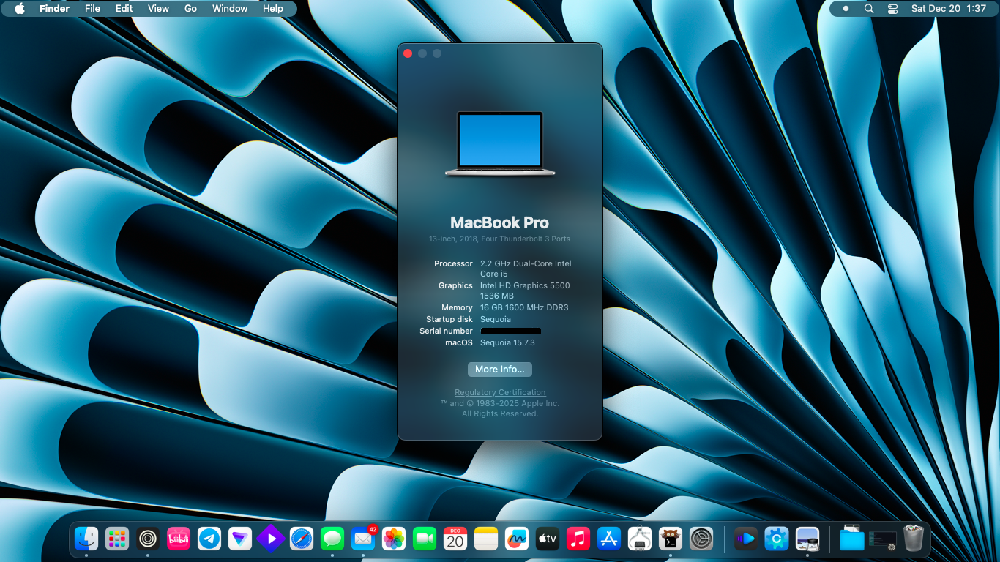
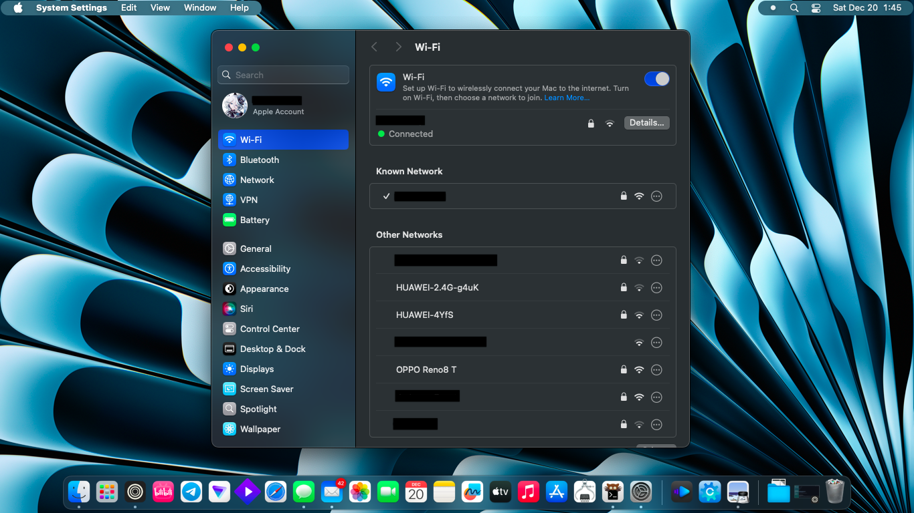
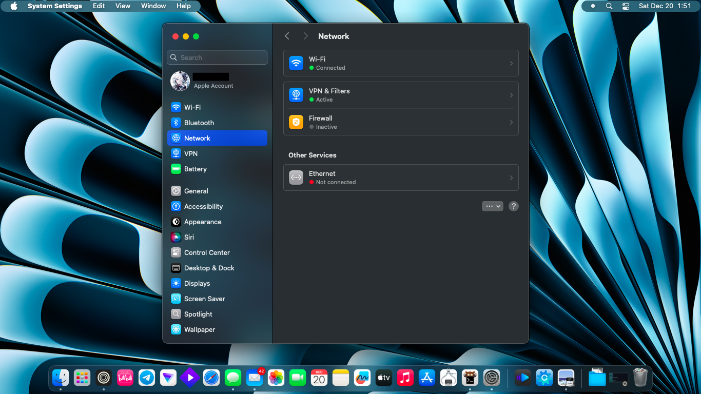

# Acer Aspire E5-571G Hackintosh (macOS Sequoia)

OpenCore-based Hackintosh configuration for **Acer Aspire E5-571G** running  
**macOS 15.7.3 (Sequoia)**.

> ⚠️ This EFI is provided for reference and educational purposes only.  
> Do NOT use it as-is. Generate your own SMBIOS values before booting.

---

## System Specifications

| Component | Model |
|---------|------|
| Laptop | Acer Aspire E5-571G |
| CPU | Intel Core i5-5500U (Broadwell) |
| iGPU | Intel HD Graphics 5500 |
| dGPU | NVIDIA GeForce 820M (Disabled) |
| RAM | 16GB DDR3 |
| Storage | WDC 1TB HDD |
| Audio | Realtek ALC283 |
| Ethernet | Realtek RTL8111 |
| Wi-Fi | Qualcomm Atheros AR9565 |
| Bluetooth | Not Working |

---

## Software Information

- macOS: **15.7.3 Sequoia**
- Bootloader: **OpenCore v0.8.8**
- SMBIOS: **MacBookPro15,2**

---

## What Works

- CPU Power Management  
- Internal Display  
- Audio (ALC283)  
- Ethernet  
- USB Ports (Mapped)  
- Battery Status  
- Keyboard  
- Web Camera  
- Brightness Control
- **Intel HD Graphics 5500 (Patched via OCLP)**  
- **Wi-Fi (Atheros AR9565, Patched via OCLP)**  

---

## Partially Working

- **Trackpad**  
  Gestures (except drag and drop) and Buttons work

---

## What Does Not Work

- **Sleep / Hibernation**  
  System reboots or crashes instead of sleeping

- **NVIDIA GeForce 820M**  
  Disabled (Optimus unsupported)

- **Bluetooth**

- **AirDrop / Handoff / Continuity**

---

## Functionality Status

| Feature | Status |
|------|------|
| CPU Power Management | Yes |
| Intel HD Graphics 5500 | Yes (OCLP Patched) |
| NVIDIA GT 820M | No (Disabled) |
| Wi-Fi | Yes (Signal icon cosmetic bug) |
| Ethernet | Yes |
| Audio | Yes |
| Keyboard | Yes |
| Trackpad | Partially (Drag and drop gestures not working) |
| Web Camera | Yes |
| USB | Yes |
| Sleep / Hibernation | No (Reboots / Crashes) |
| Bluetooth | No |

---

## Wi-Fi Notes (Qualcomm Atheros AR9565)

After OCLP patching, Wi-Fi is **fully usable**.

- Tested up to **50 Mbps on a 50 Mbps network**
- Stable for daily use

Known cosmetic issue:  
Wi-Fi icon may show **1 bar** even when close to the router.  
This does **not** affect real-world performance.

---
## 📂 EFI Structure

```text
EFI\
├── BOOT
│   └── BOOTx64.efi
└── OC
    ├── ACPI
    │   ├── SSDT-ALS0.aml
    │   ├── SSDT-Disable_GPU_RP05.aml
    │   ├── SSDT-EC.aml
    │   ├── SSDT-GPI0.aml
    │   ├── SSDT-HPET.aml
    │   ├── SSDT-MCHC.aml
    │   ├── SSDT-PLUG.aml
    │   ├── SSDT-PNLF.aml
    │   ├── SSDT-SBUS.aml
    │   └── SSDT-XOSI.aml
    ├── config.plist
    ├── Drivers
    │   ├── AudioDxe.efi
    │   ├── Ext4Dxe.efi
    │   ├── HfsPlus.efi
    │   ├── OpenCanopy.efi
    │   ├── OpenRuntime.efi
    │   └── ResetNvramEntry.efi
    ├── Kexts
    │   ├── AMFIPass.kext
    │   ├── AppleALC.kext
    │   ├── BlueToolFixup.kext
    │   ├── corecaptureElCap.kext
    │   ├── ECEnabler.kext
    │   ├── HoRNDIS.kext
    │   ├── IO80211ElCap.kext
    │   ├── Lilu.kext
    │   ├── RealtekRTL8111.kext
    │   ├── RestrictEvents.kext
    │   ├── Sinetek-rtsx.kext
    │   ├── SMCBatteryManager.kext
    │   ├── SMCLightSensor.kext
    │   ├── SMCProcessor.kext
    │   ├── SMCSuperIO.kext
    │   ├── USBToolBox.kext
    │   ├── UTBMap.kext
    │   ├── VirtualSMC.kext
    │   ├── VoodooI2C.kext
    │   ├── VoodooI2CELAN.kext
    │   ├── VoodooI2CHID.kext
    │   ├── VoodooPS2Controller.kext
    │   ├── WhateverGreen.kext
    │   ├── WifiLocFix.kext
    │   └── XHCI-unsupported.kext
    ├── OpenCore.efi
    ├── Resources
    │   ├── Audio
    │   │   └── OCEFIAudio_VoiceOver_Boot.mp3
    │   ├── Font
    │   │   ├── Font_1x.bin
    │   │   ├── Font_1x.png
    │   │   ├── Font_2x.bin
    │   │   ├── Font_2x.png
    │   │   ├── Terminus.hex
    │   │   └── TerminusCore.hex
    │   ├── Image
    │   │   └── Acidanthera
    │   │       └── GoldenGate
    │   │           ├── AppleRecv.icns
    │   │           ├── AppleTM.icns
    │   │           ├── Background.icns
    │   │           ├── BtnFocus.icns
    │   │           ├── Cursor.icns
    │   │           ├── Dot.icns
    │   │           ├── Enter.icns
    │   │           ├── ExtAppleRecv.icns
    │   │           ├── ExtAppleTM.icns
    │   │           ├── ExtHardDrive.icns
    │   │           ├── FirmwareSettings.icns
    │   │           ├── HardDrive.icns
    │   │           ├── Left.icns
    │   │           ├── Lock.icns
    │   │           ├── NetworkBoot.icns
    │   │           ├── Password.icns
    │   │           ├── Restart.icns
    │   │           ├── Right.icns
    │   │           ├── Selected.icns
    │   │           ├── Selector.icns
    │   │           ├── SetDefault.icns
    │   │           ├── Shell.icns
    │   │           ├── ShutDown.icns
    │   │           ├── Tool.icns
    │   │           └── Windows.icns
    │   └── Label
    │       ├── Apple.l2x
    │       ├── Apple.lbl
    │       ├── AppleRecv.l2x
    │       ├── AppleRecv.lbl
    │       ├── AppleTM.l2x
    │       ├── AppleTM.lbl
    │       ├── EFIBoot.l2x
    │       ├── EFIBoot.lbl
    │       ├── FirmwareSettings.l2x
    │       ├── FirmwareSettings.lbl
    │       ├── NetworkBoot.l2x
    │       ├── NetworkBoot.lbl
    │       ├── Other.l2x
    │       ├── Other.lbl
    │       ├── ResetNVRAM.l2x
    │       ├── ResetNVRAM.lbl
    │       ├── Shell.l2x
    │       ├── Shell.lbl
    │       ├── SIPDisabled.l2x
    │       ├── SIPDisabled.lbl
    │       ├── SIPEnabled.l2x
    │       ├── SIPEnabled.lbl
    │       ├── Tool.l2x
    │       ├── Tool.lbl
    │       ├── Windows.l2x
    │       └── Windows.lbl
    └── Tools
```

---

## EFI Notes

EFI initially created using [OC-Simplify](https://github.com/lzhoang2801/OpCore-Simplify), then manually adjusted and tested. Additional kexts (**IO80211ElCap.kext** and **corecaptureElCap.kext**) were added to help enable Atheros AR9565 Wi-Fi, together with OCLP post-install patching.

---

## Post-Install Patching (OCLP Required)

On macOS Sequoia, both **Intel HD Graphics 5500** and  
**Qualcomm Atheros AR9565 Wi-Fi** require **OpenCore Legacy Patcher (OCLP)**.

---

## OCLP Patch Guide (Graphics + Wi-Fi)

### Requirements

- Android phone (USB tethering)
- HoRNDIS.kext (included)
- OpenCore Legacy Patcher
- OCAuxiliaryTools

---

### Temporary Internet Access

1. Connect Android phone via USB  
2. Enable **USB Tethering**  
3. macOS will use HoRNDIS for internet  
4. Download OpenCore Legacy Patcher  

---

### Apply OCLP Patch

1. Open **OpenCore Legacy Patcher**
2. Select **Post Install Root Patch**
3. Apply recommended patches:
   - Graphics Broadwell
   - Legacy Wireless
4. When prompted to restart, **DO NOT reboot yet**

---

### OpenCore Config Fix (Important)

Before restarting:

1. Open **OCAuxiliaryTools**
2. Mount EFI "⌘ + M" and open `config.plist`
3. Navigate to:
'DeviceProperties → Add'
4. You will see two entries:

`PciRoot(0x0)/Pci(0x1C,0x3)/Pci(0x0,0x0)`

`#PciRoot(0x0)/Pci(0x1C,0x3)/Pci(0x0,0x0)`

5. After patching:
   - Add `#` to the first entry
   - Remove `#` from the second entry

Final state:

`#PciRoot(0x0)/Pci(0x1C,0x3)/Pci(0x0,0x0)`

`PciRoot(0x0)/Pci(0x1C,0x3)/Pci(0x0,0x0)`

6. Save `config.plist`
7. Unmount EFI

---

### Reboot

Restart macOS.  
Graphics acceleration and Wi-Fi should now work.

---

## SMBIOS Warning

Generate your own values:

- SystemSerialNumber  
- MLB  
- ROM  
- SystemUUID  

Use **GenSMBIOS** or **OCAuxiliaryTools**.  
Never reuse values from this repository.

---

## Screenshots

Screenshots are stored in the `Screenshots/` folder.

### About This Mac


### Wi-Fi


### Network Status


---

## Credits
- [Acidanthera](https://github.com/acidanthera) – OpenCore bootloader and core kexts  
- [Dortania OpenCore Guide](https://dortania.github.io/OpenCore-Install-Guide/)  
- [OpenCore Legacy Patcher](https://github.com/dortania/OpenCore-Legacy-Patcher)  
- [OC-Simplify](https://github.com/lzhoang2801/OpCore-Simplify)  
- Hackintosh Community

Special thanks to all developers and contributors who make the Hackintosh community possible.

---

## Disclaimer

This project is shared for **educational purposes only**.  
I am not responsible for any damage, data loss, or Apple ID issues.
